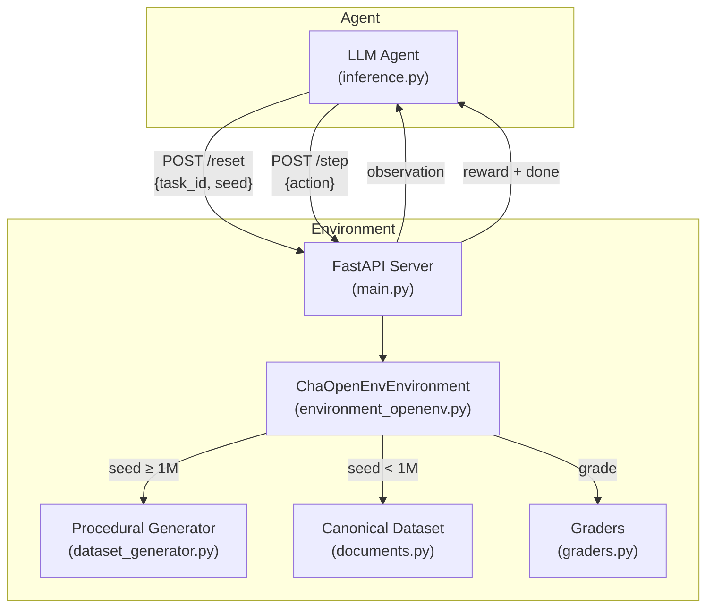

# customs-clearance-env

**OpenEnv-style environment — Custom House Agent (CHA), Indian sea freight**

**Author:** Rakesh Karthikeyan  
**Context:** Scaler School of Technology × Meta × PyTorch Hackathon (2026)

This repository simulates work a **Custom House Agent** does on **import/export sea freight**: reading shipping documents, assigning **HS codes**, spotting **compliance and consistency issues**, and recommending whether a file should **clear**, **hold**, **query the shipper**, or **refer to customs**. The domain is underrepresented in agent benchmarks; trade compliance is document-heavy, rule-driven, and high-stakes in the real world.

---

## Architecture



---

## Episode flow

### Single-step episodes (task1, task2, task3 from canonical pool)

```
reset(task_id) → observation → step(action) → reward + done=true
```

### Multi-step episodes (task3 with procedural generation)

```
reset(seed=N, task_id="task3")
  → observation (max_steps=3, step_index=0)

step(step_kind="request_information", requested_fields=["duty_rate_schedule", ...])
  → observation (revealed_content={...}, step_index=1, done=false)

step(step_kind="final_submission", hs_code=..., flags=..., ...)
  → reward + done=true
```

Multi-step is backward-compatible: for `max_steps=1` or `step_kind="final_submission"` on step 0, the environment behaves exactly like a single-step episode.

---

## Observation space

After `POST /reset`, the API returns:

| Field | Type | Description |
|--------|------|-------------|
| `document_type` | string | `invoice` (task 1) or `shipment_file` (tasks 2–3). |
| `document_content` | object | Structured shipment data: invoice lines, packing list, bill of lading, etc. |
| `task_instruction` | string | What the agent must do this episode. |
| `episode_id` | integer | Monotonic counter for the server process. |
| `shipment_id` | string | Stable id for the scenario. |
| `task_id` | string | `task1`, `task2`, or `task3`. |
| `step_index` | integer | Current step within the episode (0-based). |
| `max_steps` | integer | Maximum steps allowed (1 = single-step, 3 = multi-step). |
| `revealed_content` | object | Additional info revealed after `request_information` steps. |

---

## Action space

`POST /step` accepts:

| Field | Type | Required | Description |
|--------|------|----------|-------------|
| `hs_code` | string | yes | 8-digit HS code with dots (e.g. `8518.30.00`). |
| `flags` | array of string | no | Compliance/anomaly labels. |
| `recommendation` | string | yes | `clear` \| `hold` \| `query_shipper` \| `refer_to_customs`. |
| `confidence` | number | no | 0.0–1.0, informational. |
| `assessable_value_inr` | number | no | Task 3: estimated assessable value in INR. |
| `duty_amount_inr` | number | no | Task 3: estimated duty in INR. |
| `step_kind` | string | no | `initial_review` \| `request_information` \| `final_submission` (default). |
| `requested_fields` | array of string | no | Fields to request when `step_kind=request_information`. |

**Available fields for `request_information`:** `detailed_goods_description`, `certificate_of_origin`, `exchange_rate`, `duty_rate_schedule`.

---

## Tasks

### Task 1 — HS Code Classification (easy)

Single clean commercial invoice. Classify the goods with the correct 8-digit HS code. Exact match → full score; same chapter/heading (first 4 digits) → half score.

### Task 2 — Document Validation (medium)

Shipment file with planted inconsistencies (quantity mismatches, missing fields, undervaluation, consignee typos, weight discrepancies). List all flags and choose the correct recommendation. Scoring: 80% flag recall (with false-flag penalty) + 20% recommendation.

### Task 3 — Full Clearance Decision (hard)

Complex shipment with vague descriptions, cross-document mismatches, valuation issues, origin discrepancies, and potentially controlled goods. Agent must provide HS code, flags, recommendation, and numeric estimates of assessable value and duty in INR. Scoring: 30% HS + 30% flags + 20% recommendation + 20% value/duty (within 5% tolerance).

**Flag vocabulary:**

| Flag | Tasks | Meaning |
|------|-------|---------|
| `quantity_mismatch` | 2, 3 | PL quantity ≠ invoice quantity |
| `missing_country_of_origin` | 2, 3 | Invoice lacks origin declaration |
| `weight_mismatch_packing_vs_bl` | 2, 3 | Gross weight differs between PL and B/L |
| `invoice_number_mismatch_bl_vs_invoice` | 2, 3 | B/L references wrong invoice number |
| `missing_invoice_number_on_bl` | 2, 3 | B/L has no invoice reference |
| `goods_description_mismatch_invoice_vs_packing_list` | 2, 3 | Goods described differently across docs |
| `consignee_name_mismatch` | 2, 3 | Consignee name inconsistent |
| `missing_notify_party` | 2, 3 | B/L lacks notify party |
| `suspected_undervaluation` | 2, 3 | Declared value suspiciously low |
| `vague_goods_description` | 3 | Description too generic for classification |
| `origin_loading_mismatch` | 3 | Declared origin ≠ port of loading country |
| `high_value_shipment` | 3 | Declared value exceeds $50,000 |
| `dual_use_or_controlled_chemical_risk` | 3 | Chemical may require additional clearance |
| `textile_declaration_review` | 3 | Textile from origin requiring special review |

---

## Scoring summary (deterministic)

| Task | Components |
|------|-----------|
| **task1** | Exact HS → 1.0; same chapter (4 digits) → 0.5; else 0.0. |
| **task2** | 80% flags (recall − 0.15 per false flag) + 20% recommendation. |
| **task3** | 30% HS + 30% flag overlap + 20% recommendation + 10% assessable value (5% tol.) + 10% duty (5% tol.). |

All raw scores are mapped through `nudge_score()` → `[0.1, 0.9]` to stay within strict (0, 1) bounds. Full logic: `graders.py`.

---

## Procedural dataset generation

Beyond the 24 canonical scenarios in `documents.py`, the environment supports **unlimited procedural generation** via `dataset_generator.py`:

- **30 commodity types** across 6 categories (electronics, textiles, chemicals, machinery, hardware, food, pharma) with real Indian Customs Tariff HS codes
- **15 foreign shippers**, **10 Indian consignees**, **17 load ports**, **8 discharge ports**
- **9 error recipes** that compose via a compatibility matrix (no conflicting mutations)
- **Deterministic**: same `seed` always produces the same scenario
- **CIF valuation**: `assessable_value = declared_USD × 83.0 × (1 + 0.04 + 0.0125)`, `duty = assessable × rate`

To use procedural generation, pass `seed ≥ 1,000,000` to `/reset`:

```bash
curl -s -X POST http://localhost:7860/reset \
  -H "Content-Type: application/json" \
  -d '{"task_id":"task3","seed":1000042}' | python3 -m json.tool
```

Seeds < 1,000,000 draw from the canonical 24-scenario pool (backward-compatible).

---

## Baseline scores

Scores measured on canonical + procedural scenarios (5-run average):

| Task | Perfect Agent | Partial Agent | Score Range |
|------|--------------|---------------|-------------|
| task1 | 0.900 | 0.500 | HS exact vs chapter-only |
| task2 | 0.900 | 0.772 | All flags vs subset |
| task3 | 0.900 | 0.502 | Full analysis vs partial |

**Score interpretation:** The environment clearly differentiates agent quality. A perfect agent (all correct answers) scores 0.90 (the `nudge_score` ceiling). A partial agent that gets the HS chapter right but misses subheading, catches only one flag, and has >5% valuation error scores 0.50–0.77 depending on task complexity.

To run your own baselines:

```bash
export OPENAI_API_KEY=sk-...
export API_BASE_URL=https://api.openai.com/v1
export MODEL_NAME=gpt-4o-mini
export ENV_BASE_URL=http://127.0.0.1:7860
python inference.py
```

---

## Agent strategy guide

Tips for building a strong agent for this environment:

### Task 1 (HS classification)
- Learn the HS chapter structure: first 2 digits = chapter (e.g., 85 = electrical equipment), next 2 = heading
- The goods description in the invoice maps directly to a tariff line
- Getting the first 4 digits right earns 50% — prioritize chapter/heading accuracy

### Task 2 (document validation)
- Systematically cross-reference: invoice ↔ packing list (quantities), invoice ↔ B/L (invoice numbers, weights, consignee)
- Check for missing mandatory fields (country of origin, notify party)
- Watch for suspiciously low declared values relative to quantity and goods type
- Use exact flag strings from the vocabulary — creative paraphrasing scores 0

### Task 3 (full clearance)
- Use multi-step episodes: request `duty_rate_schedule` and `detailed_goods_description` before submitting
- CIF valuation formula: `Declared USD × 83.0 × 1.0525` = assessable value INR
- Duty = assessable value × rate (rates vary: 0% solar panels, 10% chemicals, 20% electronics, 35% textiles, 45% olive oil)
- Check origin vs loading port country — a mismatch is always a flag
- Chemicals with hazard data → `dual_use_or_controlled_chemical_risk` → `refer_to_customs`

### General
- Respond with valid JSON only — no markdown, no explanation
- Use the exact flag strings and recommendation enum values
- Confidence is informational and doesn't affect scoring

---

## API reference

| Method | Path | Description |
|--------|------|-------------|
| GET | `/` | Service id and link to `/docs`. |
| GET | `/health` | `{"status":"healthy"}`. |
| GET | `/metadata` | Environment name, description, version, author. |
| GET | `/schema` | JSON Schemas for action, observation, state. |
| POST | `/mcp` | JSON-RPC 2.0 (MCP stub). |
| POST | `/reset` | `{"task_id":"task1", "seed": optional}`. Returns observation. |
| POST | `/step` | Action JSON. Returns reward + done + observation. |
| GET | `/state` | Current episode metadata. |
| GET | `/tasks` | Task list + action schema. |
| POST | `/grader` | Score an action against ground truth. |
| GET | `/baseline` | Runs LLM baseline if API key is set. |

Interactive docs: `http://localhost:7860/docs`

---

## Local setup

```bash
python -m venv .venv && source .venv/bin/activate
pip install -r requirements.txt
uvicorn main:app --host 0.0.0.0 --port 7860
```

## Docker

```bash
docker build -t customs-clearance-env .
docker run --rm -p 7860:7860 customs-clearance-env
```

## OpenEnv validation

```bash
# Terminal A — start the server
uvicorn main:app --host 0.0.0.0 --port 7860

# Terminal B — validate
pip install openenv-core
openenv validate --url http://127.0.0.1:7860
```

---

## Repository layout

| Path | Role |
|------|------|
| `main.py` | FastAPI app entry point (uses `create_app()` from openenv SDK + custom routes). |
| `app.py` | Re-exports `app` for HF Docker (`uvicorn app:app`). |
| `environment_openenv.py` | OpenEnv `Environment` implementation with multi-step episode support. |
| `dataset_generator.py` | Procedural scenario generator (30 commodities, 9 error recipes, unlimited seeds). |
| `documents.py` | 24 canonical scenarios + ground truth (8 per task). |
| `graders.py` | Task-specific deterministic scoring. |
| `inference.py` | LLM agent driver with domain-specific prompts and multi-step support. |
| `baseline.py` | Sync REST baseline helper + `/baseline` endpoint backend. |
| `openenv.yaml` | OpenEnv environment metadata. |
| `Dockerfile` | Container for HF Spaces / local deployment. |

---

## License / attribution

Built for the **Scaler School of Technology × Meta × PyTorch Hackathon 2026**.
